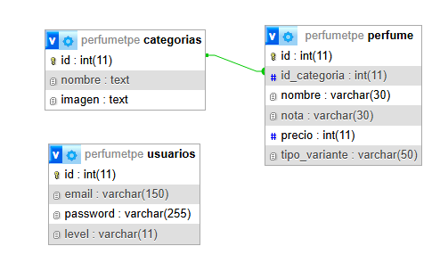

# Aura Premium - API REST (Categorías)

## Integrantes
- **Nicolas Diaz Rodriguez** (diaznicoo240@gmail.com) - **Miembro B**
- *Jerónimo Vargas* (jeronimovargas26@gmail.com) - *Miembro A (Dado de baja de la cursada)*

> **Nota de la Entrega:** Debido a la baja del Miembro A para esta etapa de la cursada, realize los requerimientos minimos del grupo (incluyendo el ruteador del PUT y el ordenamiento general), ademas de implementar las directivas especificas de su rol y los puntos opcionales para la promocion.

## Temática y Descripción
API RESTful publica que expone el modelo de datos de **Familias Olfativas (Categorías)** del catalogo de alta perfumería *Aura Premium*. Permite a aplicaciones de terceros consumir, ordenar, filtrar y (mediante tokens de seguridad) persistir datos en formato JSON puro.

---

## Arquitectura del Sistema
La API funciona bajo una arquitectura MVC *stateless* (sin estado), delegando el control de accesos a un Middleware de autenticación basado en **JSON Web Tokens (JWT)**.

### Diagrama de Entidad Relación (DER)
El modelo de datos cuenta con una relación 1:N entre las entidades **categorias** y **perfume**. Una categoría engloba multiples perfumes (`id_categoria`), y la tabla **usuarios** almacena las credenciales con su correspondiente hash para la autenticación en la API.



---

## Cómo desplegar el proyecto

### Requisitos
* Servidor Apache y MySQL (Entorno XAMPP recomendado).
* PHP 8.0 o superior.

### Pasos para la puesta en marcha:
1. Clonar o copiar este repositorio dentro de la carpeta `htdocs` de XAMPP (ej. `C:/xampp/htdocs/TPE-Perfumes/`).
2. Iniciar los servicios de Apache y MySQL en el panel de XAMPP.
3. El archivo `.htaccess` configurado en la raíz se encargará de interceptar las cabeceras `Authorization` de Apache y redirigir limpiamente las URLs hacia el archivo `router.php`.

> **Mecanismo de Auto-Deploy:** No se requiere la importacion manual de archivos `.sql`. El sistema detectara la ausencia de la base de datos en la primera consulta, creara las tablas e inyectara los registros iniciales junto con las credenciales del administrador de prueba. Para cambiar configuraciones de host o credenciales locales, editar `config.php`.

---

## Guia de Consumo y Endpoints (Pruebas en Postman)

A continuación se detallan los servicios disponibles en la dirección base:  
`http://localhost/TPE-Perfumes/api/` *(Ajustar el nombre de la carpeta si se necesita).*

###  1. Obtener Token de Administrador (Autenticacion)
Para poder realizar inserciones o modificaciones, es obligatorio obtener primero la firma JWT.
* **URL:** `POST http://localhost/TPE-Perfumes/api/auth/token`
* **Body (formato raw -> JSON):**
  ```json
  {
      "email": "adminperfume@gmail.com",
      "password": "admin"
  }
En caso de no realizar dicha autenticacion por token no se puede hacer modificaciones a los elementos

###  2. Listar Todas las Categorias + Ordenar (GET Publico)
* **URL:** `GET http://localhost/TPE-Perfumes/api/categorias?sort=nombre&order=DESC`

###  3. Filtrar Categoria por Nombre (GET Publico)
* **URL:** `GET http://localhost/TPE-Perfumes/api/categorias?nombre=Amad`

###  4. Obtener Categoria por ID + Relacion (GET Publico)
* **URL:** `GET http://localhost/TPE-Perfumes/api/categorias/5`

###  5. Crear Categoria (POST Protegido)
* **URL:** `POST http://localhost/TPE-Perfumes/api/categorias`

###  6. Modificar Categoria (PUT Protegido)
* **URL:** `PUT http://localhost/TPE-Perfumes/api/categorias/5`

###  7. Crear Categoria (POST Protegido)
* **URL:** `POST http://localhost/TPE-Perfumes/api/categorias`